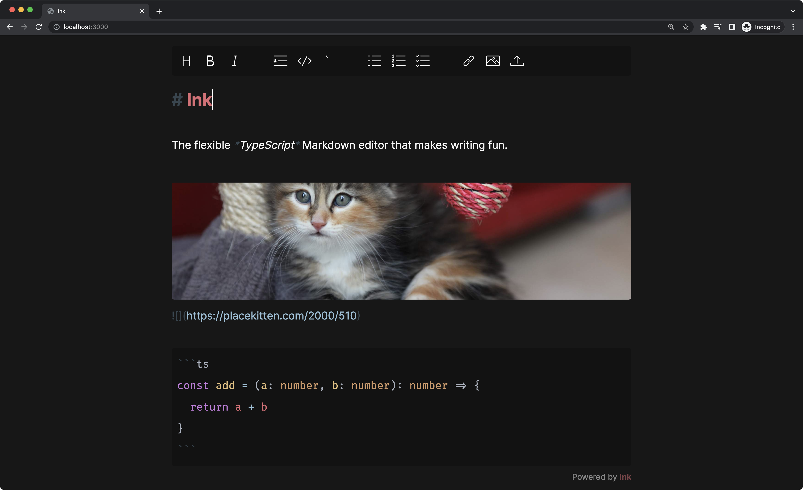

[](https://npmjs.com/package/ink-mde)
[](https://github.com/davidmyersdev/ink-mde/blob/main/LICENSE)
[](https://voracious.link/chat)

# ink-mde

A beautiful, modern, customizable Markdown editor powered by CodeMirror 6 and TypeScript. This is the editor that powers https://octo.app.



## Features

- [x] Automatic, dark, or light themes (automatic by default)
- [x] Hybrid plain-text Markdown rendering
- [x] Supports GitHub Flavored Markdown ([an extension of CommonMark](https://github.github.com/gfm/#what-is-github-flavored-markdown-))
- [x] Syntax highlighting for many common languages (in code blocks)
- [x] Drag-and-drop or paste to upload files
- [x] Inline Markdown image previews
- [x] Configurable and stylable
- [x] An optional formatting toolbar (great for mobile)
- [x] Optionally enable Vim Mode
- [x] Framework agnostic
- [x] Vue wrapper (`ink-mde/vue` subpath export)
- [x] Svelte wrapper (`ink-mde/svelte` subpath export)
- [x] Supports Server-Side Rendering (SSR)
- [x] Wrap a native `textarea` element with the `wrap` export
- [x] Plugin API (experimental)

## Getting Started

With your preferred package manager, add `ink-mde` to your project.

```sh
# npm
npm i ink-mde

# pnpm
pnpm i ink-mde

# yarn
yarn add ink-mde
```

#### Import from a CDN

The officially supported CDN for `ink-mde` is [esm.sh](https://esm.sh). Visit [esm.sh/ink-mde](https://esm.sh/ink-mde) and you will be redirected to the latest version. The URL will look something like this.

```
https://esm.sh/ink-mde@0.22.0
```

Then, import `ink` from that URL in your project.

```ts
import { ink } from 'https://esm.sh/ink-mde@0.22.0'
```

### Examples for `ink-mde`

Next, import `ink-mde` and customize it to fit your needs.

#### Minimal setup

Mount the component and start writing.

```ts
// ./examples/minimal.ts
import { ink } from 'ink-mde'

// The only requirement is an HTML element.
ink(document.getElementById('editor')!)
```

##### Wrap a native `textarea` with `wrap`

To wrap a native `textarea` element, use the `wrap` export.

```ts
import { wrap } from 'ink-mde'

wrap(document.querySelector('textarea')!)
```

#### Track state changes with hooks

To sync the editor with your app's state, you can use the `afterUpdate` hook.

```ts
// ./examples/hooks.ts
import { defineOptions, ink } from 'ink-mde'

// With hooks, you can keep your state in sync with the editor.
const state = { doc: '# Start with some text' }

// Use defineOptions for automatic type hinting.
const options = defineOptions({
  doc: state.doc,
  hooks: {
    afterUpdate: (doc: string) => {
      state.doc = doc
    },
  },
})

const editor = ink(document.getElementById('editor')!, options)

// You can also update the editor directly.
editor.update(state.doc)
```

### Examples for `ink-mde/vue`

The `ink-mde/vue` subpath exports a Vue 3 component.

#### Minimal setup

```vue
<template>
  <InkMde v-model="markdown" />
</template>

<script lang="ts" setup>
import InkMde from 'ink-mde/vue'
import { ref } from 'vue'

const markdown = ref('# Hello, World!')
</script>
```

#### Custom Options

The Vue component forwards all options that `ink-mde` supports, and it uses a deep watcher to ensure your `options` are reactive.

```vue
<template>
  <input v-model="options.interface.appearance" type="radio" value="dark"> dark
  <input v-model="options.interface.appearance" type="radio" value="light"> light
  <InkMde v-model="markdown" :options="options" />
</template>

<script lang="ts" setup>
import InkMde from 'ink-mde/vue'
import { reactive, ref } from 'vue'

const markdown = ref('# Hello, World!')
const options = reactive({
  interface: {
    appearance: 'dark',
  },
})
</script>
```

### Examples for `ink-mde/svelte`

The `ink-mde/svelte` subpath exports a Svelte component.

#### Minimal setup

```svelte
<script lang="ts">
  import InkMde from 'ink-mde/svelte'

  // doc
  let value = '# Hello, world'
</script>

<InkMde
  bind:value
  options={{
    interface: {
      appearance: 'dark'
    }
  }}
/>
```

#### Reactive options and the editor instance

```svelte
<script lang="ts">
  import InkMde from 'ink-mde/svelte'
  import type { Instance } from 'ink-mde'

  // doc
  let value = '# Hello, world'
  // reactive option, if this change, the editor will be reconfigured.
  let isDarkTheme = false
</script>

<input type="checkbox" bind:checked={isDarkTheme} name="isDarkTheme" />

<InkMde
  bind:value
  options={{
    interface: {
      appearance: isDarkTheme ? 'dark' : 'light',
    },
  }}
/>
```

## Further customization

These are the default options, and any of them can be overridden when initializing (or reconfiguring) an instance of `ink-mde`.

```ts
// ./src/store.ts#L11-L54
const options = {
  doc: '',
  files: {
    clipboard: false,
    dragAndDrop: false,
    handler: () => {},
    injectMarkup: true,
    types: ['image/*'],
  },
  hooks: {
    afterUpdate: () => {},
    beforeUpdate: () => {},
  },
  interface: {
    appearance: InkValues.Appearance.Auto,
    attribution: true,
    autocomplete: false,
    images: false,
    lists: false,
    readonly: false,
    spellcheck: true,
    toolbar: false,
  },
  placeholder: '',
  plugins: [],
  readability: false,
  search: true,
  selections: [],
  toolbar: {
    bold: true,
    code: true,
    codeBlock: true,
    heading: true,
    image: true,
    italic: true,
    link: true,
    list: true,
    orderedList: true,
    quote: true,
    taskList: true,
    upload: false,
  },
  vim: false,
}
```

### Plugins

The editor can be extended with custom grammars, completions, and more through the Plugin API. Examples coming soon.

### Appearance

Many aspects of the editor's appearance can be customized with CSS custom properties (aka CSS variables).

#### General-purpose styles

| CSS Custom Property    | CSS Property       | Default (Dark) | Override (Light) |
| ----                   | ----               | ----           | ----             |
| `--ink-border-radius`  | `border-radius`    | `0.25rem`      |                  |
| `--ink-color`          | `color`            | `#fafafa`      | `#171717`        |
| `--ink-font-family`    | `font-family`      | `sans-serif`   |                  |
| `--ink-flex-direction` | `flex-direction`   | `column`       |                  |

#### Block styles

Blocks are used to provide a dynamic user experience. Examples of blocks are images, multiline code blocks, and the toolbar.

| CSS Custom Property                     | CSS Property       | Default (Dark) | Override (Light) |
| ----                                    | ----               | ----           | ----             |
| `--ink-block-background-color`          | `background-color` | `#121212`      | `#f5f5f5`        |
| `--ink-block-background-color-on-hover` | `background-color` | `#0f0f0f`      | `#e0e0e0`        |
| `--ink-block-max-height`                | `max-height`       | `20rem`        |                  |
| `--ink-block-padding`                   | `padding`          | `0.5rem`       |                  |

#### Code styles

These styles are for code blocks and inline code.

| CSS Custom Property           | CSS Property       | Default (Dark)                      | Override (Light) |
| ----                          | ----               | ----                                | ----             |
| `--ink-code-background-color` | `background-color` | `var(--ink-block-background-color)` |                  |
| `--ink-code-color`            | `color`            | `inherit`                           |                  |
| `--ink-code-font-family`      | `font-family`      | `'Monaco', Courier, monospace`      |                  |

#### Syntax highlighting

You can customize the entire syntax theme too.

| CSS Custom Property                           | CSS Property       | Default (Dark) | Override (Light) |
| ----                                          | ----               | ----           | ----             |
| `--ink-syntax-atom-color`                     | `color`            | `#d19a66`      |                  |
| `--ink-syntax-comment-color`                  | `color`            | `#abb2bf`      |                  |
| `--ink-syntax-emphasis-color`                 | `color`            | `inherit`      |                  |
| `--ink-syntax-emphasis-font-style`            | `font-style`       | `italic`       |                  |
| `--ink-syntax-heading-color`                  | `color`            | `#e06c75`      |                  |
| `--ink-syntax-heading-font-size`              | `font-size`        | `1em`          |                  |
| `--ink-syntax-heading-font-weight`            | `font-weight`      | `600`          |                  |
| `--ink-syntax-heading1-color`                 | `color`            | `#e06c75`      |                  |
| `--ink-syntax-heading1-font-size`             | `font-size`        | `1.6em`        |                  |
| `--ink-syntax-heading1-font-weight`           | `font-weight`      | `600`          |                  |
| `--ink-syntax-heading2-color`                 | `color`            | `#e06c75`      |                  |
| `--ink-syntax-heading2-font-size`             | `font-size`        | `1.5em`        |                  |
| `--ink-syntax-heading2-font-weight`           | `font-weight`      | `600`          |                  |
| `--ink-syntax-heading3-color`                 | `color`            | `#e06c75`      |                  |
| `--ink-syntax-heading3-font-size`             | `font-size`        | `1.4em`        |                  |
| `--ink-syntax-heading3-font-weight`           | `font-weight`      | `600`          |                  |
| `--ink-syntax-heading4-color`                 | `color`            | `#e06c75`      |                  |
| `--ink-syntax-heading4-font-size`             | `font-size`        | `1.3em`        |                  |
| `--ink-syntax-heading4-font-weight`           | `font-weight`      | `600`          |                  |
| `--ink-syntax-heading5-color`                 | `color`            | `#e06c75`      |                  |
| `--ink-syntax-heading5-font-size`             | `font-size`        | `1.2em`        |                  |
| `--ink-syntax-heading5-font-weight`           | `font-weight`      | `600`          |                  |
| `--ink-syntax-heading6-color`                 | `color`            | `#e06c75`      |                  |
| `--ink-syntax-heading6-font-size`             | `font-size`        | `1.1em`        |                  |
| `--ink-syntax-heading6-font-weight`           | `font-weight`      | `600`          |                  |
| `--ink-syntax-keyword-color`                  | `color`            | `#c678dd`      |                  |
| `--ink-syntax-link-color`                     | `color`            | `#96c0d8`      |                  |
| `--ink-syntax-meta-color`                     | `color`            | `#abb2bf`      |                  |
| `--ink-syntax-name-color`                     | `color`            | `#d19a66`      |                  |
| `--ink-syntax-name-label-color`               | `color`            | `#abb2bf`      |                  |
| `--ink-syntax-name-property-color`            | `color`            | `#96c0d8`      |                  |
| `--ink-syntax-name-property-definition-color` | `color`            | `#e06c75`      |                  |
| `--ink-syntax-name-variable-color`            | `color`            | `#e06c75`      |                  |
| `--ink-syntax-name-variable-definition-color` | `color`            | `#e5c07b`      |                  |
| `--ink-syntax-name-variable-local-color`      | `color`            | `#d19a66`      |                  |
| `--ink-syntax-name-variable-special-color`    | `color`            | `inherit`      |                  |
| `--ink-syntax-number-color`                   | `color`            | `#d19a66`      |                  |
| `--ink-syntax-operator-color`                 | `color`            | `#96c0d8`      |                  |
| `--ink-syntax-processing-instruction-color`   | `color`            | `#444444`      | `#bbbbbb`        |
| `--ink-syntax-punctuation-color`              | `color`            | `#abb2bf`      |                  |
| `--ink-syntax-strikethrough-color`            | `color`            | `inherit`      |                  |
| `--ink-syntax-strikethrough-text-decoration`  | `text-decoration`  | `line-through` |                  |
| `--ink-syntax-string-color`                   | `color`            | `#98c379`      |                  |
| `--ink-syntax-string-special-color`           | `color`            | `inherit`      |                  |
| `--ink-syntax-strong-color`                   | `color`            | `inherit`      |                  |
| `--ink-syntax-strong-font-weight`             | `font-weight`      | `600`          |                  |
| `--ink-syntax-url-color`                      | `color`            | `#aaaaaa`      | `#666666`        |

## Support

Your support is appreciated. Here are some ways you can help. ♥️

### Leave the Attribution enabled

There is a small `powered by ink-mde` attribution in the bottom-right corner of all editor instances by default. Being a free, MIT-licensed library under independent development, that attribution helps to increase awareness of this project and my work in general.

### Tell us what you think

Your feedback is immensely important for building `ink-mde` into a library that we all love. Consider [starting a discussion](https://github.com/davidmyersdev/octo/discussions) under [Octo](https://github.com/davidmyersdev/octo) if you have a question or just want to chat about ideas!

### Open a Pull Request

If you feel comfortable with [an existing issue](https://github.com/davidmyersdev/ink-mde/issues), please consider opening a Pull Request. I would love to work with you to get it merged!

### Become a financial backer

- [GitHub Sponsors](https://github.com/sponsors/davidmyersdev)
- [Open Collective](https://opencollective.com/davidmyersdev)
- [Patreon](https://patreon.com/davidmyersdev)
- [Ko-Fi](https://ko-fi.com/davidmyersdev)
- [Buy Me a Coffee](https://www.buymeacoffee.com/davidmyersdev)

## A note about v0 releases

Since `ink-mde` is a v0 project, you should consider **minor** version increments to be **breaking** changes. Semantic Versioning [considers _all_ v0 releases to be breaking](https://semver.org/#spec-item-4), but I do my best to make patch releases non-breaking.
