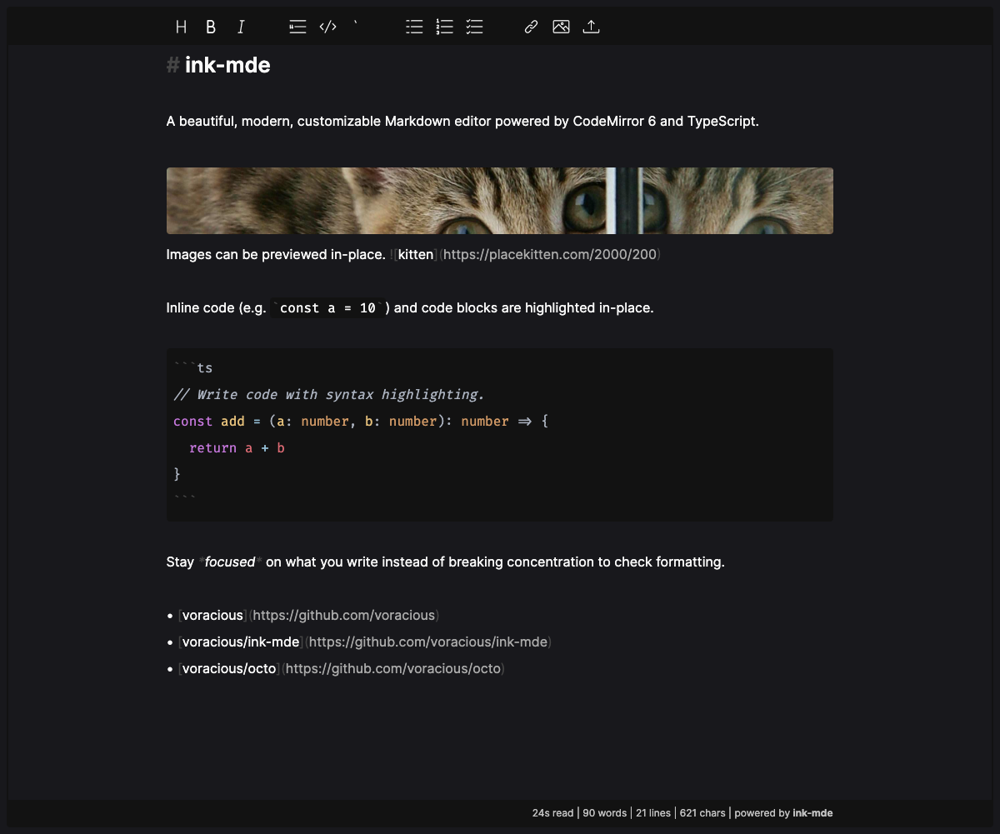

[](https://github.com/writewithocto/ink/releases)
[](https://github.com/writewithocto/ink/blob/master/LICENSE)
[](https://github.com/writewithocto/ink/issues)

# Ink

The flexible TypeScript Markdown editor that powers https://octo.app.



## Features

- [x] Automatic, dark, or light themes (automatic by default)
- [x] Hybrid plain-text Markdown rendering
- [x] Supports GitHub Flavored Markdown ([an extension of CommonMark](https://github.github.com/gfm/#what-is-github-flavored-markdown-))
- [x] Syntax highlighting for many common languages (in code blocks)
- [x] Drag-and-drop or paste to upload files
- [x] Inline Markdown image previews
- [x] Configurable and stylable
- [x] An optional formatting toolbar (great for mobile)
- [x] Vim Mode

## How to install

Ink is written in TypeScript and provides both ES and UMD packages.

#### Yarn

```bash
yarn add @writewithocto/ink
```

#### NPM

```bash
npm install --save @writewithocto/ink
```

## Getting started

There are many ways to customize Ink to fit your needs. Here are a few examples to get you started.

### Minimal setup

Mount the component and start writing.

```ts
// ./examples/minimal.ts

import ink from '@writewithocto/ink'

// The only requirement is an HTML element.
ink(document.getElementById('editor')!)
```

### Track state changes with hooks

To sync the editor with your app's state, you can use the `afterUpdate` hook.

```ts
// ./examples/hooks.ts

import { defineOptions, ink } from '@writewithocto/ink'

// With hooks, you can keep your state in sync with the editor.
const state = { doc: '# Start with some text' }

// Use defineOptions for automatic type hinting.
const options = defineOptions({
  doc: state.doc,
  hooks: {
    afterUpdate: (doc: string) => {
      state.doc = doc
    },
  },
})

const editor = ink(document.getElementById('editor')!, options)

// You can also update the editor directly.
editor.update(state.doc)
```

## Further customization

Other features of the editor can be customized through the following options.

| Option                          | Description                                | Type                                        | Default    |
| ----                            | ----                                       | ----                                        | ----       |
| `options.doc`                   | Initialize the editor with an existing doc | `string`                                    | `''`       |
| `options.files.clipboard`       | Enable file uploads on paste               | `boolean`                                   | `false`    |
| `options.files.dragAndDrop`     | Enable drag-and-drop file uploads          | `boolean`                                   | `false`    |
| `options.files.handler`         | Handle file uploads (not handled by Ink)   | `(files: FileList) => Promise<any> \| void` | `() => {}` |
| `options.hooks.afterUpdate`     | Run some code after the doc is updated     | `(doc: string) => void`                     | `() => {}` |
| `options.hooks.beforeUpdate`    | Run some code before the doc is updated    | `(doc: string) => void`                     | `() => {}` |
| `options.interface.appearance`  | Change the editor theme                    | `'auto' \| 'dark' \| 'light'`               | `'auto'`   |
| `options.interface.attribution` | Show the "Powered by Ink" attribution      | `boolean`                                   | `true`     |
| `options.interface.images`      | Render images in the editor                | `boolean`                                   | `false`    |
| `options.interface.spellcheck`  | Enable spellcheck                          | `boolean`                                   | `true`     |
| `options.interface.toolbar`     | Enable the formatting toolbar              | `boolean`                                   | `false`    |
| `options.plugins`               | Extend the editor with custom features     | `Ink.Editor.Plugin[]`                       | `[]`       |
| `options.selections`            | Initialize the editor with selections      | `Ink.Editor.Selection[]`                    | `[]`       |
| `options.toolbar.bold`          | Include this button in the toolbar         | `boolean`                                   | `true`     |
| `options.toolbar.code`          | Include this button in the toolbar         | `boolean`                                   | `true`     |
| `options.toolbar.codeBlock`     | Include this button in the toolbar         | `boolean`                                   | `true`     |
| `options.toolbar.heading`       | Include this button in the toolbar         | `boolean`                                   | `true`     |
| `options.toolbar.image`         | Include this button in the toolbar         | `boolean`                                   | `true`     |
| `options.toolbar.italic`        | Include this button in the toolbar         | `boolean`                                   | `true`     |
| `options.toolbar.link`          | Include this button in the toolbar         | `boolean`                                   | `true`     |
| `options.toolbar.list`          | Include this button in the toolbar         | `boolean`                                   | `true`     |
| `options.toolbar.orderedList`   | Include this button in the toolbar         | `boolean`                                   | `true`     |
| `options.toolbar.quote`         | Include this button in the toolbar         | `boolean`                                   | `true`     |
| `options.toolbar.taskList`      | Include this button in the toolbar         | `boolean`                                   | `true`     |
| `options.toolbar.upload`        | Include this button in the toolbar         | `boolean`                                   | `false`    |
| `options.vim`                   | Use Vim keybindings to edit the doc        | `boolean`                                   | `false`    |

### Plugins

The editor can be extended with custom grammars, completions, and more through the Plugin API.


### Appearance

Many aspects of the editor's appearance can be customized with CSS custom properties (aka CSS variables).

#### General-purpose styles

| CSS Custom Property    | CSS Property       | Default (Dark) | Override (Light) |
| ----                   | ----               | ----           | ----             |
| `--ink-border-radius`  | `border-radius`    | `0.25rem`      |                  |
| `--ink-color`          | `color`            | `#fafafa`      | `#171717`        |
| `--ink-font-family`    | `font-family`      | `sans-serif`   |                  |
| `--ink-flex-direction` | `flex-direction`   | `column`       |                  |

#### Block styles

Blocks are used to provide a dynamic user experience. Examples of blocks are images, multiline code blocks, and the toolbar.

| CSS Custom Property                     | CSS Property       | Default (Dark) | Override (Light) |
| ----                                    | ----               | ----           | ----             |
| `--ink-block-background-color`          | `background-color` | `#121212`      | `#f5f5f5`        |
| `--ink-block-background-color-on-hover` | `background-color` | `#0f0f0f`      | `#e0e0e0`        |
| `--ink-block-max-height`                | `max-height`       | `20rem`        |                  |
| `--ink-block-padding`                   | `padding`          | `0.5rem`       |                  |

#### Code styles

These styles are for code blocks and inline code.

| CSS Custom Property           | CSS Property       | Default (Dark)                      | Override (Light) |
| ----                          | ----               | ----                                | ----             |
| `--ink-code-background-color` | `background-color` | `var(--ink-block-background-color)` |                  |
| `--ink-code-color`            | `color`            | `inherit`                           |                  |
| `--ink-code-font-family`      | `font-family`      | `'Monaco', Courier, monospace`      |                  |

#### Syntax highlighting

You can customize the entire syntax theme too.

| CSS Custom Property                           | CSS Property       | Default (Dark) | Override (Light) |
| ----                                          | ----               | ----           | ----             |
| `--ink-syntax-atom-color`                     | `color`            | `#d19a66`      |                  |
| `--ink-syntax-comment-color`                  | `color`            | `#abb2bf`      |                  |
| `--ink-syntax-emphasis-color`                 | `color`            | `inherit`      |                  |
| `--ink-syntax-emphasis-font-style`            | `font-style`       | `italic`       |                  |
| `--ink-syntax-heading-color`                  | `color`            | `#e06c75`      |                  |
| `--ink-syntax-heading-font-size`              | `font-size`        | `1em`          |                  |
| `--ink-syntax-heading-font-weight`            | `font-weight`      | `600`          |                  |
| `--ink-syntax-heading1-color`                 | `color`            | `#e06c75`      |                  |
| `--ink-syntax-heading1-font-size`             | `font-size`        | `1.6em`        |                  |
| `--ink-syntax-heading1-font-weight`           | `font-weight`      | `600`          |                  |
| `--ink-syntax-heading2-color`                 | `color`            | `#e06c75`      |                  |
| `--ink-syntax-heading2-font-size`             | `font-size`        | `1.5em`        |                  |
| `--ink-syntax-heading2-font-weight`           | `font-weight`      | `600`          |                  |
| `--ink-syntax-heading3-color`                 | `color`            | `#e06c75`      |                  |
| `--ink-syntax-heading3-font-size`             | `font-size`        | `1.4em`        |                  |
| `--ink-syntax-heading3-font-weight`           | `font-weight`      | `600`          |                  |
| `--ink-syntax-heading4-color`                 | `color`            | `#e06c75`      |                  |
| `--ink-syntax-heading4-font-size`             | `font-size`        | `1.3em`        |                  |
| `--ink-syntax-heading4-font-weight`           | `font-weight`      | `600`          |                  |
| `--ink-syntax-heading5-color`                 | `color`            | `#e06c75`      |                  |
| `--ink-syntax-heading5-font-size`             | `font-size`        | `1.2em`        |                  |
| `--ink-syntax-heading5-font-weight`           | `font-weight`      | `600`          |                  |
| `--ink-syntax-heading6-color`                 | `color`            | `#e06c75`      |                  |
| `--ink-syntax-heading6-font-size`             | `font-size`        | `1.1em`        |                  |
| `--ink-syntax-heading6-font-weight`           | `font-weight`      | `600`          |                  |
| `--ink-syntax-keyword-color`                  | `color`            | `#c678dd`      |                  |
| `--ink-syntax-link-color`                     | `color`            | `#96c0d8`      |                  |
| `--ink-syntax-meta-color`                     | `color`            | `#abb2bf`      |                  |
| `--ink-syntax-name-color`                     | `color`            | `#d19a66`      |                  |
| `--ink-syntax-name-label-color`               | `color`            | `#abb2bf`      |                  |
| `--ink-syntax-name-property-color`            | `color`            | `#96c0d8`      |                  |
| `--ink-syntax-name-property-definition-color` | `color`            | `#e06c75`      |                  |
| `--ink-syntax-name-variable-color`            | `color`            | `#e06c75`      |                  |
| `--ink-syntax-name-variable-definition-color` | `color`            | `#e5c07b`      |                  |
| `--ink-syntax-name-variable-local-color`      | `color`            | `#d19a66`      |                  |
| `--ink-syntax-name-variable-special-color`    | `color`            | `inherit`      |                  |
| `--ink-syntax-number-color`                   | `color`            | `#d19a66`      |                  |
| `--ink-syntax-operator-color`                 | `color`            | `#96c0d8`      |                  |
| `--ink-syntax-processing-instruction-color`   | `color`            | `#444444`      | `#bbbbbb`        |
| `--ink-syntax-punctuation-color`              | `color`            | `#abb2bf`      |                  |
| `--ink-syntax-strikethrough-color`            | `color`            | `inherit`      |                  |
| `--ink-syntax-strikethrough-text-decoration`  | `text-decoration`  | `line-through` |                  |
| `--ink-syntax-string-color`                   | `color`            | `#98c379`      |                  |
| `--ink-syntax-string-special-color`           | `color`            | `inherit`      |                  |
| `--ink-syntax-strong-color`                   | `color`            | `inherit`      |                  |
| `--ink-syntax-strong-font-weight`             | `font-weight`      | `600`          |                  |
| `--ink-syntax-url-color`                      | `color`            | `#96c0d8`      |                  |

## Support

Your support is appreciated. Here are some ways you can help. ♥️

### Leave the Attribution enabled

There is a small `Powered by Ink` attribution in the bottom-right corner of all Ink instances by default. Ink is a free MIT-licensed library under independent development, and that attribution helps to increase awareness of this project.

### Tell us what you think

Your feedback is immensely important for building Ink into a library that we all love. Consider [starting a discussion](https://github.com/writewithocto/octo/discussions) under [Octo](https://github.com/writewithocto/octo) if you have a question or just want to chat about ideas!

### Open a Pull Request

If you feel comfortable with [an existing issue](https://github.com/writewithocto/ink/issues), please consider opening a Pull Request. I would love to work with you to get it merged!

### Become a financial backer

- [GitHub Sponsors](https://github.com/sponsors/voraciousdev)
- [Patreon](https://patreon.com/voraciousdev)
- [Ko-Fi](https://ko-fi.com/voraciousdev)
- [Buy Me a Coffee](https://www.buymeacoffee.com/voraciousdev)
